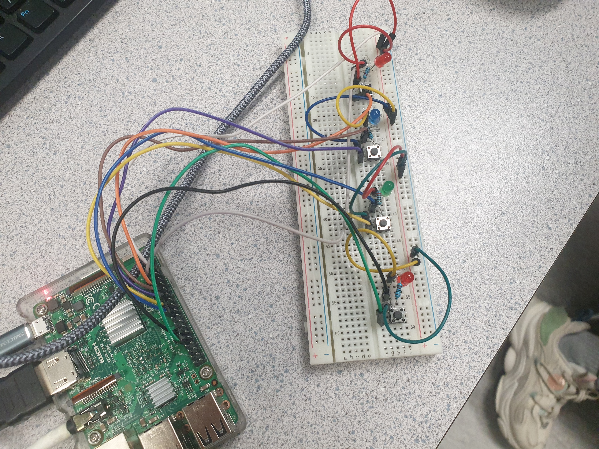
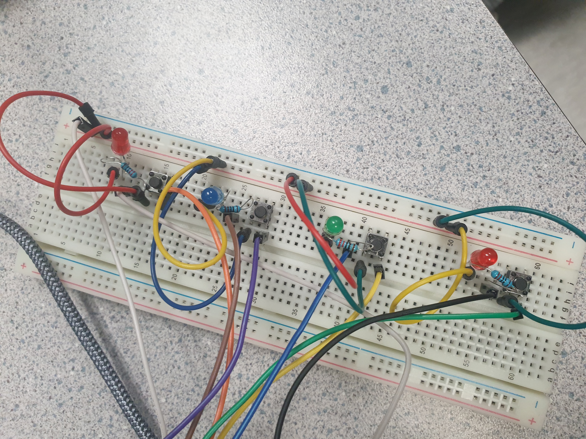
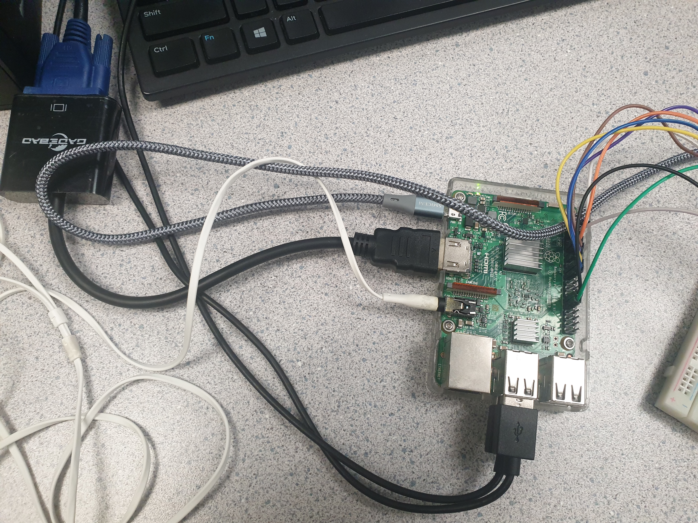

# Dance-Dance-Fingerlution
Dance-Dance-Fingerlution is an interactive game project that integrates physical buttons, LED lights, and sound to create an engaging gameplay experience. Here's a breakdown of its components and functionalities:

### Components Used:
- **Raspberry Pi:** Serves as the central computing unit.
- **Tactile Switches:** Used as buttons for player interaction.
- **LED Lights:** Provide visual feedback to the player.
- **Resistors:** Used to regulate current flow in the circuit.
- **Breadboard:** For prototyping and circuit assembly.
- **Jumper Leads:** Connect various components on the breadboard.
- **Headphones:** Output audio feedback to the player.

### Layout of the hardware components:

### Game Logic:
1. Randomized Pattern Generation: The Raspberry Pi generates a random sequence of button presses represented by LED lights.
2. Player Interaction: The player must replicate the sequence by pressing the corresponding buttons.
3. Feedback Mechanism:
   - Visual: LED lights illuminate to represent the sequence.
   - Auditory: Sound effects accompany each button press and provide feedback on success or failure.
4. Scoring and Progression: If the player correctly replicates the sequence, they advance to the next level with an additional step in the sequence. Otherwise, the game ends.

### Technical Implementation:
- Python Programming: Game logic and GPIO (General Purpose Input/Output) control are programmed using Python.
- GPIO Control: Utilizes the `gpiozero` library for interfacing with GPIO pins.
- Audio Playback: Sound effects are played using the `pygame.mixer` module.
- Button Press Detection: GPIO interrupts are used to detect button presses.
- Looping and Conditional Statements: Utilized to manage game flow, sequence generation, and player input validation.

### Game Demonstration
Demonstration of how the buttons work:

Demonstration of sample game round: 

### Future Improvements:
- Implementing a mechanism to run the game code automatically upon Raspberry Pi boot-up.

Overall, Dance-Dance-Fingerlution combines hardware and software elements to create an interactive and entertaining gaming experience, showcasing skills in embedded systems, programming, and electronics design.
